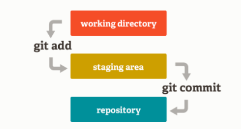

## 常用的git指令

### 1.仓库操作
#### 1.1 查看版本
```
git -v
------------------------------
git version 2.41.0.windows.3
```

#### 1.2 创建本地仓库
在当前路径创建本地仓库
```
git init
---------------------------------------------
Initialized empty Git repository in D:/my_files/others/Notes/git/local-rep-1/.git/
```

#### 1.3 克隆远程仓库
```
git clone https://github.com/zcai0612/test.git
-----------------------------------------------
Cloning into 'test'...
remote: Enumerating objects: 3, done.
remote: Counting objects: 100% (3/3), done.
remote: Total 3 (delta 0), reused 0 (delta 0), pack-reused 0
Receiving objects: 100% (3/3), done.
```
远程克隆时还可以修改名称
```
git clone https://github.com/zcai0612/test.git mytest
dir
-----------------------------------------------------
2023/08/12  18:48    <DIR>          mytest
2023/08/12  18:45    <DIR>          test
```

#### 1.4 配置仓库
```
git config user.name xxxx
git config user.email xxxx
```
在config文件中可以看到自己配置的结果。

以上是对单一的仓库进行配置，还可以进行全局配置。
```
git config --global user.name xxx
```
全局的配置文件保存在`C:\Users\xxx\.gitconfig`当中。

### 2.文件操作

git包含三个区域：工作区，暂存区，存储区（仓库）。
#### 2.1 查询暂存区的状态
```
git status
---------------------------------------------
On branch main
Your branch is up to date with 'origin/main'.

Untracked files:
  (use "git add <file>..." to include in what will be committed)
        a.txt

nothing added to commit but untracked files present (use "git add" to track)
```
此时工作区中`a.txt`文件还没有被加入到暂存区（没有被git跟踪）。

#### 2.2 将工作区的文件加入到暂存区中
```
git add a.txt

git status
---------------------------------------------------
On branch main
Your branch is up to date with 'origin/main'.

Changes to be committed:
  (use "git restore --staged <file>..." to unstage)
        new file:   a.txt
```
可以看到`a.txt`已经被加入到了暂存区当中（被git跟踪）。

移动所有文件：
```
git add *
```
也可以加上特定的后缀：
```
git add *.txt
```

#### 2.3 移动暂存区文件到工作区
```
git restore --staged a.txt
git status
----------------------------------------------------
our branch is up to date with 'origin/main'.

Untracked files:
  (use "git add <file>..." to include in what will be committed)
        a.txt

nothing added to commit but untracked files present (use "git add" to track)
```
文件`a.txt`又回到了未被追踪的状态。

```
git rm --cached a.txt
----------------------
rm 'a.txt'
```
```
git status
-------------------------------------------------------
On branch main
Your branch is up to date with 'origin/main'.

Untracked files:
  (use "git add <file>..." to include in what will be committed)
        a.txt

nothing added to commit but untracked files present (use "git add" to track)
```
可见`git rm --cached`也有相同的功能。

#### 2.4 将暂存区的文件存储到仓库当中
```
git commit -m 新增文件
----------------------------
[main 8a30e2f] 新增文件
 1 file changed, 1 insertion(+)
 create mode 100644 a.txt
```
其中`-m`代表消息（提交的信息）。
```
git status
--------------------------------------------------
On branch main
Your branch is ahead of 'origin/main' by 1 commit.
  (use "git push" to publish your local commits)

nothing to commit, working tree clean
```
此时文件已经提交，工作区无内容。

#### 2.5 查看提交历史
```
git log
---------------------------------------------------------------
commit 8a30e2f0e970fe42dc7d4e2c6cd671796be20dca (HEAD -> main)
Author: caizeyu <2413049166@qq.com>
Date:   Sat Aug 12 20:52:56 2023 +0800
...
    新增文件
```

```
git log --oneline
---------------------------------------------
8a30e2f (HEAD -> main) 新增文件
2fdc763 (origin/main, origin/HEAD) Initial commit
```
使用`--oneline`可以让输出更加简洁。

#### 2.6 删除文件
如果删除`a.txt`:
```
git status
-----------------------------------------------------------------
On branch main
Your branch is ahead of 'origin/main' by 1 commit.
  (use "git push" to publish your local commits)

Changes not staged for commit:
  (use "git add/rm <file>..." to update what will be committed)
  (use "git restore <file>..." to discard changes in working directory)
        deleted:    a.txt

no changes added to commit (use "git add" and/or "git commit -a")
```
此时文件（历史文件）仍然在存储区中，只是不再引用了。删除本质上也是一种提交，仍然需要`add`，`commit`。
```
git add a.txt
git commit -m 删除a.txt
----------------------------------
[main 896a783] 删除a.txt
 1 file changed, 1 deletion(-)
 delete mode 100644 a.txt
```
```
git log --oneline
-----------------------------------
896a783 (HEAD -> main) 删除a.txt
8a30e2f 新增文件
2fdc763 (origin/main, origin/HEAD) Initial commit
```

#### 2.7 恢复误删除文件
删除文件在工作区，但一般情况下存储区中还存在文件，只需将存储区中的文件恢复到工作区当中。
```
git status
--------------------------------------------------------------------
Changes not staged for commit:
  (use "git add/rm <file>..." to update what will be committed)
  (use "git restore <file>..." to discard changes in working directory)
        deleted:    a.txt

no changes added to commit (use "git add" and/or "git commit -a")
```
```
git restore a.txt
git status
--------------------------------------------------
On branch main
Your branch is ahead of 'origin/main' by 3 commits.
  (use "git push" to publish your local commits)

nothing to commit, working tree clean
```
此时通过`restore`操作即可恢复文件。

但如果将删除文件的操作也`add`和`commit`了，即
```
git add a.txt
git commit -m delete
```
此时需要查看历史记录。
```
git log --oneline
---------------------------------------
bddd2a0 (HEAD -> main) delete
602e000 add
896a783 删除a.txt
8a30e2f 新增文件
2fdc763 (origin/main, origin/HEAD) Initial commit
```
在`602e000`时，文件还存在，所以将当前的版本回溯到该版本。
```
git reset --hard 602e000
---------------------------
HEAD is now at 602e000 add
```
```
git status
-----------------------------------------------------
On branch main
Your branch is ahead of 'origin/main' by 3 commits.
  (use "git push" to publish your local commits)

nothing to commit, working tree clean
```
```
git log --oneline
-----------------------------------
602e000 (HEAD -> main) add
896a783 删除a.txt
8a30e2f 新增文件
2fdc763 (origin/main, origin/HEAD) Initial commit
```
但回溯重置的过程将`commit`的记录也给删除了，如需避免这种情况，如下：
```
git revert 3cb0c7f
-----------------------------------------------
[main 723f917] Revert "delete"
 1 file changed, 0 insertions(+), 0 deletions(-)
 create mode 100644 a.txt
```
```
git log --oneline
-----------------------------------------
723f917 (HEAD -> main) Revert "delete"
3cb0c7f delete
602e000 add
896a783 删除a.txt
8a30e2f 新增文件
2fdc763 (origin/main, origin/HEAD) Initial commit
```
可见`revert`操作保留了提交记录，相当于撤销了删除操作。

### 3.分支操作
#### 3.1 创建分支
```
git branch user
git branch -v
--------------------------
* master 93e2f4f 添加a.txt
  user   93e2f4f 添加a.txt
```

#### 3.2 切换分支
```
git checkout user
git branch -v
--------------------------
  master 93e2f4f 添加a.txt
* user   93e2f4f 添加a.txt
```

创建和切换分支还可以合并在一起：
```
git checkout -b order
git branch -v
--------------------------
  master 93e2f4f 添加a.txt
* order  93e2f4f 添加a.txt
  user   93e2f4f 添加a.txt
```

#### 3.3 删除分支
```
git branch -d user
git branch -v
--------------------------
  master 93e2f4f 添加a.txt
* order  93e2f4f 添加a.txt
```

#### 3.4 合并分支
在`master`和`order`分支中分别添加内容不同`b.txt`文件并上传，此时需要合并分支并解决冲突，首先先切换到`master`分支并执行合并操作:
```
git merge order
----------------------------------------------------------------
Auto-merging b.txt
CONFLICT (add/add): Merge conflict in b.txt
Automatic merge failed; fix conflicts and then commit the result.
```
显示为在`b.txt`文件中存在冲突，需要进行解决，此时查看`b.txt`文件中的内容为：
```
<<<<<<< HEAD
master
=======
order
>>>>>>> order
```
手动修改为：
```
master
order
```
随后进行文件提交：
```
git add b.txt
git commit -m 提交修改后的b.txt
```

### 4.标签操作
#### 4.1 添加标签
```
git log
------------------------------------------------------------------
commit 965286bb9427b2bd48307189f9ebcb013a2be520 (HEAD -> master)
Author: caizeyu <2413049166@qq.com>
Date:   Sat Aug 12 22:39:11 2023 +0800

    添加b.txt

commit fa3f350a0aec729dd495c60031bb749dfc33f92b
Author: caizeyu <2413049166@qq.com>
Date:   Sat Aug 12 22:38:46 2023 +0800

    修改a.txt

commit 963bc7697f7f8882687e283ecfcde7298d9d7791
Author: caizeyu <2413049166@qq.com>
Date:   Sat Aug 12 22:38:14 2023 +0800

    添加a.txt
```
观察可知，每一个提交的版本号非常长，并且难以获知具体的操作，所以可以给提交的版本号打上标签（`tag`），标签不能重复。
```
git tag update_file fa3f350a0aec729dd495c60031bb749dfc33f92b
```
```
git tag
----------
update_file
```
```
git log --oneline
-----------------------------------
965286b (HEAD -> master) 添加b.txt
fa3f350 (tag: update_file) 修改a.txt
963bc76 添加a.txt
```
此时便获得了一个`update_file`标签，可以查看该标签及之前的commit操作：
```
git log update_file
------------------------------------------------------------------
commit fa3f350a0aec729dd495c60031bb749dfc33f92b (tag: update_file)
Author: caizeyu <2413049166@qq.com>
Date:   Sat Aug 12 22:38:46 2023 +0800

    修改a.txt

commit 963bc7697f7f8882687e283ecfcde7298d9d7791
Author: caizeyu <2413049166@qq.com>
Date:   Sat Aug 12 22:38:14 2023 +0800

    添加a.txt
```
```
git log update_file --oneline
-------------------------------------
fa3f350 (tag: update_file) 修改a.txt
963bc76 添加a.txt
```

#### 4.2 删除标签
```
git tag -d update_file
git log --oneline
-------------------------------------
965286b (HEAD -> master) 添加b.txt
fa3f350 修改a.txt
963bc76 添加a.txt
```

#### 4.3 用标签创建分支
实际上的分支就是对某个版本号的引用，既然标签可以表示某个版本号，那么当然也就可以用来创建分支。
```
git log --oneline
-------------------------------------
965286b (HEAD -> master) 添加b.txt
fa3f350 修改a.txt
963bc76 (tag: add_file) 添加a.txt
```
此时有`add_file`标签，用其来创建分支。
```
git checkout -b add_file
git branch -v
--------------------------
* add_file 965286b 添加b.txt
  master   965286b 添加b.txt
```

### 5.远程仓库
#### 5.1 连接远程仓库
首先与远程仓库进行连接绑定,再将本地仓库的内容推送到远程仓库：
```
git init                           //初始化仓库
git add .(文件name)                //添加文件到本地 
git commit -m 'first commit'      //添加文件描述信息
git remote add origin  远程仓库地址 //链接远程仓库 
git pull origin main           // 把本地仓库的变化连接到远程仓库main分支
git push -u origin main        //把本地仓库的文件推送到远程仓库main分支   
```